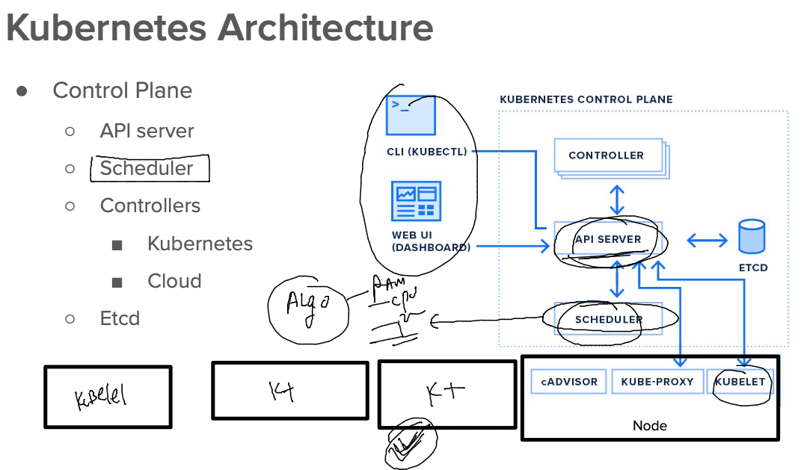
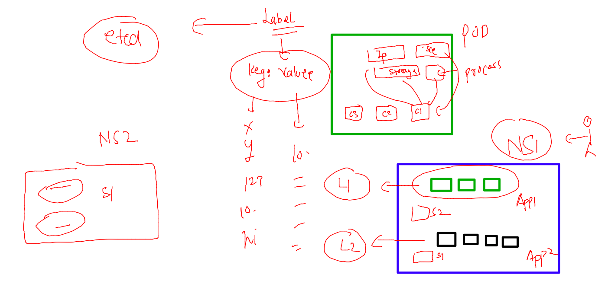
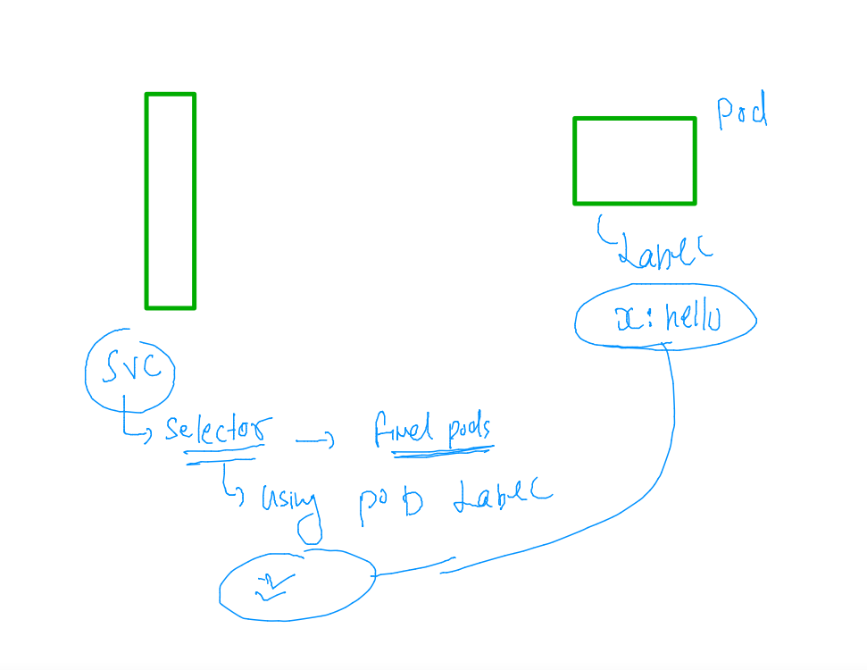
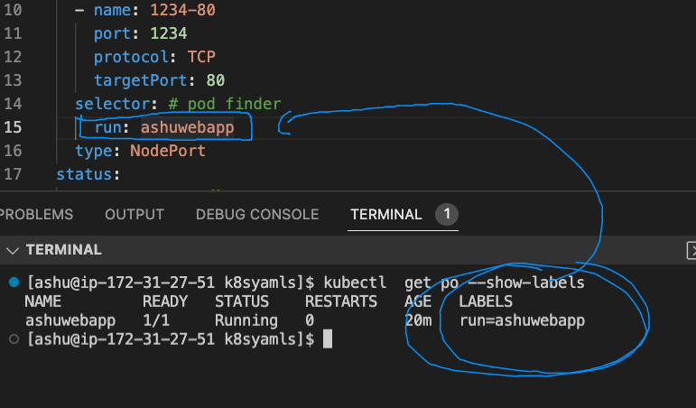

## Docker and kubernetes 

## Revision 

### Understanding using Jenkins -- CI process


### how pod got scheduled 



### pod with labels concept in particular namespaces 



### lets clean up namespace resources 

```
[ashu@ip-172-31-27-51 images]$ kubectl config get-contexts 
CURRENT   NAME                          CLUSTER      AUTHINFO           NAMESPACE
*         kubernetes-admin@kubernetes   kubernetes   kubernetes-admin   ashu-project
[ashu@ip-172-31-27-51 images]$ kubectl get po,svc
NAME             READY   STATUS    RESTARTS      AGE
pod/ashuwebpod   1/1     Running   2 (56m ago)   16h

NAME              TYPE       CLUSTER-IP      EXTERNAL-IP   PORT(S)          AGE
service/ashulb1   NodePort   10.102.22.126   <none>        1234:30868/TCP   16h
[ashu@ip-172-31-27-51 images]$ kubectl delete pod,svc --all
pod "ashuwebpod" deleted
service "ashulb1" deleted
[ashu@ip-172-31-27-51 images]$ 

```

### creating pod 

```
 kubectl run ashuwebapp --image=dockerashu/ashuapp:mobiv1 --port 80    --dry-run=client -o yaml  >newwebpod.yaml
```
### lets run it 

```
[ashu@ip-172-31-27-51 k8syamls]$ kubectl create -f newwebpod.yaml 
pod/ashuwebapp created
[ashu@ip-172-31-27-51 k8syamls]$ kubectl  get  po
NAME         READY   STATUS    RESTARTS   AGE
ashuwebapp   1/1     Running   0          5s
[ashu@ip-172-31-27-51 k8syamls]$ kubectl  get  po -o wide
NAME         READY   STATUS    RESTARTS   AGE   IP              NODE    NOMINATED NODE   READINESS GATES
ashuwebapp   1/1     Running   0          10s   192.168.135.3   node3   <none>           <none>
[ashu@ip-172-31-27-51 k8syamls]$ 


```

### describe pod 

```
[ashu@ip-172-31-27-51 ~]$ kubectl describe pod  ashuwebapp 
Name:         ashuwebapp
Namespace:    ashu-project
Priority:     0
Node:         node3/172.31.26.16
Start Time:   Wed, 17 Aug 2022 05:12:27 +0000
Labels:       run=ashuwebapp
Annotations:  cni.projectcalico.org/containerID: 486337804d40067451777b12e2f773a4b4c8ed41319f28da9ecee97c3b561731
              cni.projectcalico.org/podIP: 192.168.135.3/32
              cni.projectcalico.org/podIPs: 192.168.135.3/32
Status:       Running
IP:           192.168.135.3
IPs:
  IP:  192.168.135.3
Containers:
  ashuwebapp:
    Container ID:   containerd://1e229dfe8d134be79a93c5b547f322d11eeb66db9f5897f60552a42d4cb38a4d
    Image:          dockerashu/ashuapp:mobiv1
    Image ID:       docker.io/dockerashu/ashuapp@sha256:7e053cf4679bf4027c48e93108474daa9ef31a3f48758f0efe27ada00289a1fb
    Port:           80/TCP

```

### checking label of pod 

```
[ashu@ip-172-31-27-51 ~]$ kubectl get po --show-labels 
NAME         READY   STATUS    RESTARTS   AGE   LABELS
ashuwebapp   1/1     Running   0          13m   run=ashuwebapp
[ashu@ip-172-31-27-51 ~]$ 

```

### creating nodeport service in k8s 

```
[ashu@ip-172-31-27-51 k8syamls]$ kubectl  create  service  
Create a service using a specified subcommand.

Aliases:
service, svc

Available Commands:
  clusterip      Create a ClusterIP service
  externalname   Create an ExternalName service
  loadbalancer   Create a LoadBalancer service
  nodeport       Create a NodePort service

```

### creating service 

```
kubectl  create  service   nodeport  ashulb1  --tcp  1234:80  --dry-run=client -o yaml >newnodeport.yaml 
```
### service need label of pod to find 



### pod label to service selector 



### checking 

```
[ashu@ip-172-31-27-51 k8syamls]$ kubectl  create  -f newnodeport.yaml 
service/ashulb1 created
[ashu@ip-172-31-27-51 k8syamls]$ kubectl get  svc 
NAME      TYPE       CLUSTER-IP     EXTERNAL-IP   PORT(S)          AGE
ashulb1   NodePort   10.98.74.143   <none>        1234:30621/TCP   9s
[ashu@ip-172-31-27-51 k8syamls]$ kubectl get  svc -o wide
NAME      TYPE       CLUSTER-IP     EXTERNAL-IP   PORT(S)          AGE   SELECTOR
ashulb1   NodePort   10.98.74.143   <none>        1234:30621/TCP   13s   run=ashuwebapp
[ashu@ip-172-31-27-51 k8syamls]$ 

```

### verify 

```

```
