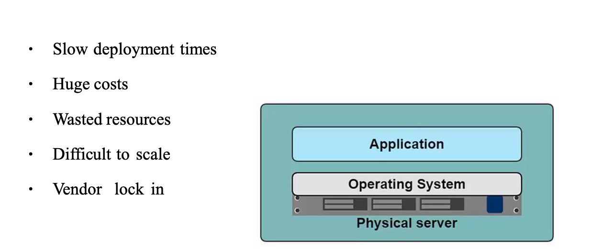
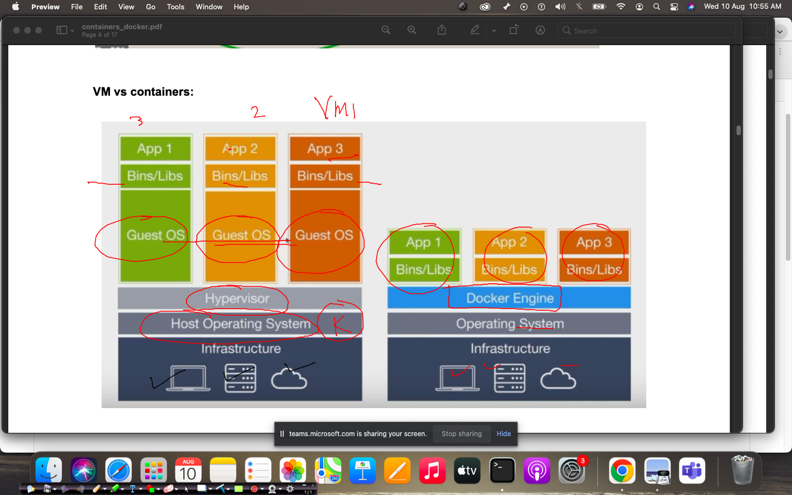
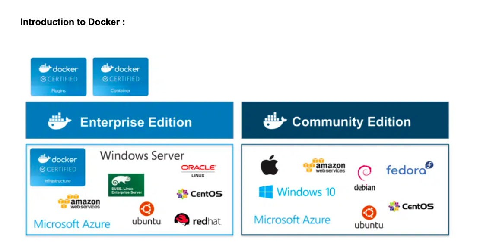

# app testing / deployment problems in History 



### solution by Hypervisor 


### vm vs container 



### intro to DOcker 



## Installing docker in amazon linux 2 

```
[root@ip-172-31-27-51 ~]# yum install  docker  -y 
Failed to set locale, defaulting to C
Loaded plugins: extras_suggestions, langpacks, priorities, update-motd
Resolving Dependencies
--> Running transaction check
---> Package docker.x86_64 0:20.10.17-1.amzn2 will be installed
--> Processing Dependency: runc >= 1.0.0 for package: docker-20.10.17-1.amzn2.x86_64
--> Processing Dependency: libcgroup >= 0.40.rc1-5.15 for package: docker-20.10.17-1.amzn2.x86_64
--> Processing Dependency: containerd >= 1.3.2 for package: docker-20.10.17-1.amzn2.x86_64
--> Processing Dependency: pigz for package: docker-20.10.17-1.amzn2.x86_64
--> Running transaction check
---> Package containerd.x86_64 0:1.6.6-1.amzn2 will be installed
---> Package libcgroup.x86_64 0:0.41-21.amzn2 will be installed
---> Package pigz.x86_64 0:2.3.4-1.amzn2.0.1 will be installed
---> Package runc.x86_64 0:1.1.3-1.amzn2 will be installed
--> Finished Dependency Resolution

Dependencies Resolved

==========================================================================================================================
 Package                   Arch    
```

### starting docker service 

```
[root@ip-172-31-27-51 ~]# systemctl start  docker 
[root@ip-172-31-27-51 ~]# systemctl status  docker 
● docker.service - Docker Application Container Engine
   Loaded: loaded (/usr/lib/systemd/system/docker.service; disabled; vendor preset: disabled)
   Active: active (running) since Wed 2022-08-10 05:43:11 UTC; 5s ago
     Docs: https://docs.docker.com
  Process: 4294 ExecStartPre=/usr/libexec/docker/docker-setup-runtimes.sh (code=exited, status=0/SUCCESS)
  Process: 4292 ExecStartPre=/bin/mkdir -p /run/docker (code=exited, status=0/SUCCESS)
 Main PID: 4298 (dockerd)
    Tasks: 13
   Memory: 23.0M
   CGroup: /system.slic
```


### connecting to docker server using ssh from local laptop 

```
fire@ashutoshhs-MacBook-Air ~ % ssh  ashu@44.224.112.97 
The authenticity of host '44.224.112.97 (44.224.112.97)' can't be established.
ECDSA key fingerprint is SHA256:S9UG+wHiBF15Eky05gArZtRs/CvG7IvLoMGwhV0Vkyo.
Are you sure you want to continue connecting (yes/no/[fingerprint])? yes
Warning: Permanently added '44.224.112.97' (ECDSA) to the list of known hosts.
ashu@44.224.112.97's password: 

       __|  __|_  )
       _|  (     /   Amazon Linux 2 AMI
      ___|\___|___|

https://aws.amazon.com/amazon-linux-2/
2 package(s) needed for security, out of 10 available
Run "sudo yum update" to apply all updates.
-bash: warning: setlocale: LC_CTYPE: cannot change locale (UTF-8): No such file or directory
[ashu@ip-172-31-27-51 ~]$ 
[ashu@ip-172-31-27-51 ~]$ 
[ashu@ip-172-31-27-51 ~]$ 
```


