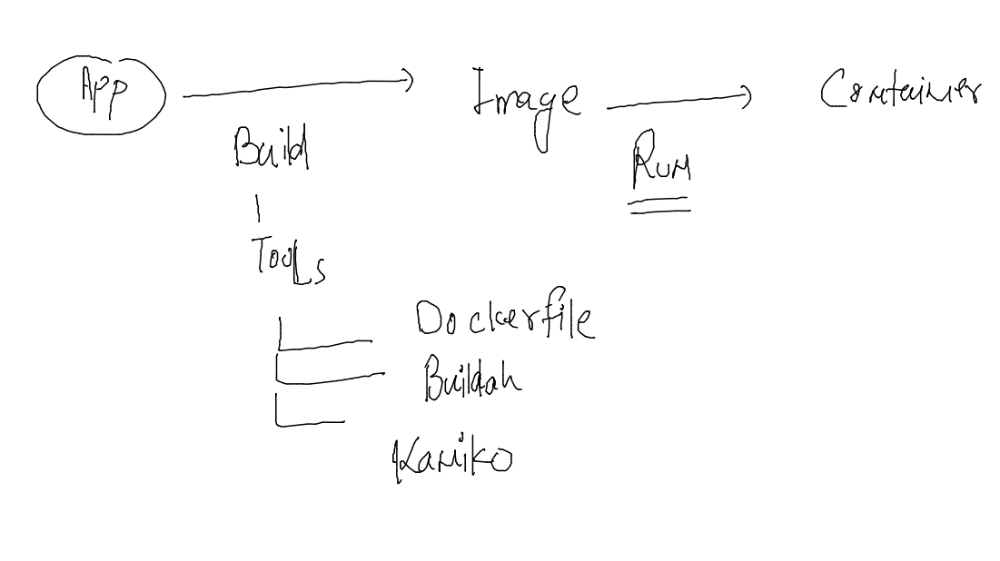

# app testing / deployment problems in History 


### solution by Hypervisor 


### vm vs container 


### intro to DOcker 


## Installing docker in amazon linux 2 

```
[root@ip-172-31-27-51 ~]# yum install  docker  -y 
Failed to set locale, defaulting to C
Loaded plugins: extras_suggestions, langpacks, priorities, update-motd
Resolving Dependencies
--> Running transaction check
---> Package docker.x86_64 0:20.10.17-1.amzn2 will be installed
--> Processing Dependency: runc >= 1.0.0 for package: docker-20.10.17-1.amzn2.x86_64
--> Processing Dependency: libcgroup >= 0.40.rc1-5.15 for package: docker-20.10.17-1.amzn2.x86_64
--> Processing Dependency: containerd >= 1.3.2 for package: docker-20.10.17-1.amzn2.x86_64
--> Processing Dependency: pigz for package: docker-20.10.17-1.amzn2.x86_64
--> Running transaction check
---> Package containerd.x86_64 0:1.6.6-1.amzn2 will be installed
---> Package libcgroup.x86_64 0:0.41-21.amzn2 will be installed
---> Package pigz.x86_64 0:2.3.4-1.amzn2.0.1 will be installed
---> Package runc.x86_64 0:1.1.3-1.amzn2 will be installed
--> Finished Dependency Resolution

Dependencies Resolved

==========================================================================================================================
 Package                   Arch    
```

### starting docker service 

```
[root@ip-172-31-27-51 ~]# systemctl start  docker 
[root@ip-172-31-27-51 ~]# systemctl status  docker 
● docker.service - Docker Application Container Engine
   Loaded: loaded (/usr/lib/systemd/system/docker.service; disabled; vendor preset: disabled)
   Active: active (running) since Wed 2022-08-10 05:43:11 UTC; 5s ago
     Docs: https://docs.docker.com
  Process: 4294 ExecStartPre=/usr/libexec/docker/docker-setup-runtimes.sh (code=exited, status=0/SUCCESS)
  Process: 4292 ExecStartPre=/bin/mkdir -p /run/docker (code=exited, status=0/SUCCESS)
 Main PID: 4298 (dockerd)
    Tasks: 13
   Memory: 23.0M
   CGroup: /system.slic
```


### connecting to docker server using ssh from local laptop 

```
fire@ashutoshhs-MacBook-Air ~ % ssh  ashu@44.224.112.97 
The authenticity of host '44.224.112.97 (44.224.112.97)' can't be established.
ECDSA key fingerprint is SHA256:S9UG+wHiBF15Eky05gArZtRs/CvG7IvLoMGwhV0Vkyo.
Are you sure you want to continue connecting (yes/no/[fingerprint])? yes
Warning: Permanently added '44.224.112.97' (ECDSA) to the list of known hosts.
ashu@44.224.112.97's password: 

       __|  __|_  )
       _|  (     /   Amazon Linux 2 AMI
      ___|\___|___|

https://aws.amazon.com/amazon-linux-2/
2 package(s) needed for security, out of 10 available
Run "sudo yum update" to apply all updates.
-bash: warning: setlocale: LC_CTYPE: cannot change locale (UTF-8): No such file or directory
[ashu@ip-172-31-27-51 ~]$ 
[ashu@ip-172-31-27-51 ~]$ 
[ashu@ip-172-31-27-51 ~]$ 
```

### COnnecting to docker server / host from docker client 

```
[ashu@ip-172-31-27-51 ~]$ docker  version 
Client:
 Version:           20.10.17
 API version:       1.41
 Go version:        go1.18.3
 Git commit:        100c701
 Built:             Thu Jun 16 20:08:47 2022
 OS/Arch:           linux/amd64
 Context:           default
 Experimental:      true

Server:
 Engine:
  Version:          20.10.17
  API version:      1.41 (minimum version 1.12)
  Go version:       go1.18.3
  Git commit:       a89b842
  Built:            Thu Jun 16 20:09:24 2022
  OS/Arch:          linux/amd64
  Experimental:     false
```


### checking images list 

```
[ashu@ip-172-31-27-51 ~]$ docker  images
REPOSITORY   TAG       IMAGE ID   CREATED   SIZE
[ashu@ip-172-31-27-51 ~]$ 

```

### pulling images from docker hub to docker server 

```
[ashu@ip-172-31-27-51 ~]$ docker  images
REPOSITORY   TAG       IMAGE ID   CREATED   SIZE
[ashu@ip-172-31-27-51 ~]$ docker  pull mysql 
Using default tag: latest
latest: Pulling from library/mysql
Digest: sha256:ce2ae3bd3e9f001435c4671cf073d1d5ae55d138b16927268474fc54ba09ed79
Status: Image is up to date for mysql:latest
docker.io/library/mysql:latest
[ashu@ip-172-31-27-51 ~]$ docker  images
REPOSITORY   TAG       IMAGE ID       CREATED      SIZE
mysql        latest    7b94cda7ffc7   6 days ago   446MB
[ashu@ip-172-31-27-51 ~]$ 

```

### creating container 

```
[ashu@ip-172-31-27-51 ~]$ docker  images
REPOSITORY   TAG       IMAGE ID       CREATED        SIZE
alpine       latest    9c6f07244728   14 hours ago   5.54MB
openjdk      latest    b32de7d15480   6 days ago     464MB
mysql        latest    7b94cda7ffc7   6 days ago     446MB
python       latest    ae9660359c2a   6 days ago     922MB
busybox      latest    7a80323521cc   11 days ago    1.24MB
[ashu@ip-172-31-27-51 ~]$ docker  run  --name  ashuc1  -d  alpine  ping fb.com  
1d680d26985bd63cb198935d628b6d47fd905e076fde498d02c28dd16ada2790
[ashu@ip-172-31-27-51 ~]$ 

```

### checking list of running containers 

```
[root@ip-172-31-27-51 ~]# docker  ps
CONTAINER ID   IMAGE     COMMAND             CREATED              STATUS              PORTS     NAMES
1433175489b4   alpine    "ping fb.com"       33 seconds ago       Up 32 seconds                 afrozc1
20087905d15f   alpine    "ping fb.com"       45 seconds ago       Up 44 seconds                 aishc1
ad6aa2cceb90   alpine    "ping fb.com"       About a minute ago   Up About a minute             mayank
662424e9a4bf   alpine    "ping fb.com"       About a minute ago   Up About a minute             dhruv1
a98c04547978   alpine    "ping fb.com"       About a minute ago   Up About a minute             kanekac1
b7241eabb4d5   alpine    "ping fb.com"       About a minute ago   Up About a minute             neha1
c2eabcf50af7   alpine    "ping fb.com"       About a minute ago   Up About a minute             gaurikac1
4b7187ab4c60   alpine    "ping fb.com"       About a minute ago   Up About a minute             sankalp
5b8af0969164   alpine    "ping fb.com"       About a minute ago   Up About a minute             lakshayc1
1aa7fe86e606   alpine    "ping google.com"   About a minute ago   Up About a minute             mohitc1
7511c88014f0   alpine    "ping fb.com"       About a minute ago   Up About a minute             pra1
c2ce443cc305   alpine    "ping fb.com"       About a minute ago   Up About a minute             aditi
208a924752a2   alpine    "ping fb.com"  
```

### checking resources used by containers 

```
[root@ip-172-31-27-51 ~]# docker  stats  ashuc1 
CONTAINER ID   NAME      CPU %     MEM USAGE / LIMIT   MEM %     NET I/O           BLOCK I/O   PIDS
1d680d26985b   ashuc1    0.01%     344KiB / 31.35GiB   0.00%     61.5kB / 58.3kB   0B / 0B     1
^C
[root@ip-172-31
```

### stopping a running container 

```
[root@ip-172-31-27-51 ~]# docker  stop  ashuc1
ashuc1
[root@ip-172-31-27-51 ~]# 


```

### checking all the containers 

```
[root@ip-172-31-27-51 ~]# docker  ps  -a
CONTAINER ID   IMAGE     COMMAND             CREATED          STATUS                            PORTS     NAMES
1368bfc8f565   alpine    "ping fb.com"       5 minutes ago    Up 5 minutes                                tanishqCon
869316c50642   alpine    "fb.com"            9 minutes ago    Created                                     tanishqContainer
4d41ecf12ca9   alpine    "ping fb.com"       11 minutes ago   Exited (137) About a minute ago             shubhamc1
62ecf874b736   alpine    "ping fb.com"       11 minutes ago   Exited (137) 2 minutes ago                  yashc2
67540c3396cb   alpine    "ping fb.com"       11 minutes ago   Exited (137) About a minute ago             deepakc1
7ade5ece0625   alpine    "ping fb.com"       12 minutes ago   Exited (137) 2 minutes ago                  divyac
501834d97d24   python    "ping fb.com"       12 minutes ago   Created                                     yashc1
1433175489b4   alpine    "ping fb.com"       12 minutes ago   Exited (137) About a minute ago             afrozc1
20087905d15f   alpine    "ping fb.com"       13 minutes ago   Up 13 minutes                               aishc1
ad6aa2cceb90   alpine    "ping fb.com"       13 minutes ago   Up 13 minutes                               mayank
662424e9a4bf   alpine    "ping fb.com"  
```

### starting a stopped container 

```
[root@ip-172-31-27-51 ~]# docker  start  ashuc1
ashuc1
[root@ip-172-31-27-51 ~]# 
[root@ip-172-31-27-51 ~]# 
[root@ip-172-31-27-51 ~]# 
[root@ip-172-31-27-51 ~]# docker  ps
CONTAINER ID   IMAGE     COMMAND         CREATED          STATUS          PORTS     NAMES
4d41ecf12ca9   alpine    "ping fb.com"   12 minutes ago   Up 7 seconds              shubhamc1
7ade5ece0625   alpine    "ping fb.com"   13 minutes ago   Up 10 seconds             divyac
20087905d15f   alpine    "ping fb.com"   14 minutes ago   Up 14 minutes             aishc1
ad6aa2cceb90   alpine    "ping fb.com"   14 minutes ago   Up 14 minutes             mayank
662424e9a4bf   alpine    "ping fb.com"   14 minutes ago   Up 5 seconds              dhruv1
4b7187ab4c60   alpine    "ping fb.com"   15 minutes ago   Up 3 seconds              sankalp
5b8af0969164   alpine    "ping fb.com"   15 minutes ago   Up 6 seconds              lakshayc1
403f4e8657de   alpine    "ping fb.com"   15 minutes ago   Up 7 seconds              ferozc1
eaa37050cc42   alpine    "ping fb.com"   15 minutes ago   Up 9 seconds              roni
1d680d26985b   alpine    "ping fb.com"   17 minutes ago   Up 9 seconds              ashuc1
```

### image building using dockerfile 



### creating directory structure 

```
[ashu@ip-172-31-27-51 ~]$ pwd
/home/ashu
[ashu@ip-172-31-27-51 ~]$ mkdir  images 
[ashu@ip-172-31-27-51 ~]$ ls
images
[ashu@ip-172-31-27-51 ~]$ mkdir  images/java   images/python  images/node 
[ashu@ip-172-31-27-51 ~]$ ls
images
[ashu@ip-172-31-27-51 ~]$ ls  images/
java  node  python
[ashu@ip-172-31-27-51 ~]$ 


```
## creating custom images 

### python based image 

### code 

```
import time

while True:
    print("Hello all , welcome to python..!!")
    time.sleep(3)
    print("Welcome to Mobi..")
    time.sleep(2)
    print("Welcome to Containers ..!!")
    print("______________________")
    time.sleep(3)
```

### dockerfile 

```
FROM python
#  docker engine will pull image from Docker hub if not present 
LABEL name=ashutoshh
LABEL email=ashutoshh@linux.com 
# optional field but you can share image Designer info 
RUN mkdir /code 
# is to give shell in container during image build time 
COPY hello.py /code/ 
# to copy data from docker clien to docker server during image build time
CMD ["python","/code/hello.py"]
#  to set default process for container 
```

###  buidling docker image 

```
[ashu@ip-172-31-27-51 images]$ ls
java  node  python
[ashu@ip-172-31-27-51 images]$ docker build  -t  ashupython:v1   python/
Sending build context to Docker daemon  3.072kB
Step 1/6 : FROM python
 ---> ae9660359c2a
Step 2/6 : LABEL name=ashutoshh
 ---> Running in 002b58eb0b68
Removing intermediate container 002b58eb0b68
 ---> 9a6b23975d15
Step 3/6 : LABEL email=ashutoshh@linux.com
 ---> Running in 1bf196580221
Removing intermediate container 1bf196580221
 ---> 8023dc95dd6e
Step 4/6 : RUN mkdir /code
 ---> Running in 027e7fe4a790
Removing intermediate container 027e7fe4a790
 ---> 094b6f33faad
Step 5/6 : COPY hello.py /code/
 ---> 0bddd7cab466
Step 6/6 : CMD ["python","/code/hello.py"]
 ---> Running in 5c134ba08176
Removing intermediate container 5c134ba08176
 ---> f687c61f100b
Successfully built f687c61f100b
Successfully tagged ashupython:v1
```

### creating container from image 
```
[ashu@ip-172-31-27-51 images]$ docker  run --name ashupyc1  -itd ashupython:v1  
c37a892cfddc9964cc415e8377f1d28f148df95713866081b3a29743e284c8a4
[ashu@ip-172-31-27-51 images]$ docker  ps
CONTAINER ID   IMAGE           COMMAND                  CREATED                  STATUS                  PORTS     NAMES
0a62e0520182   dimppython:v1   "python /code/hello.…"   Less than a second ago   Up Less than a second             dimpc1
c37a892cfddc   ashupython:v1   "python /code/hello.…"   4 seconds ago            Up 3 seconds                      ashupyc1
```

### checking output of container program 

```
[ashu@ip-172-31-27-51 images]$ docker logs  ashupyc1 
Hello all , welcome to python..!!
Welcome to Mobi..
Welcome to Containers ..!!
______________________
Hello all , welcome to python..!!
Welcome to Mobi..
Welcome to Containers ..!!
______________________
Hello all , welcome to python..!!
Welcome to Mobi..
Welcome to Containers ..!!
______________________
```


