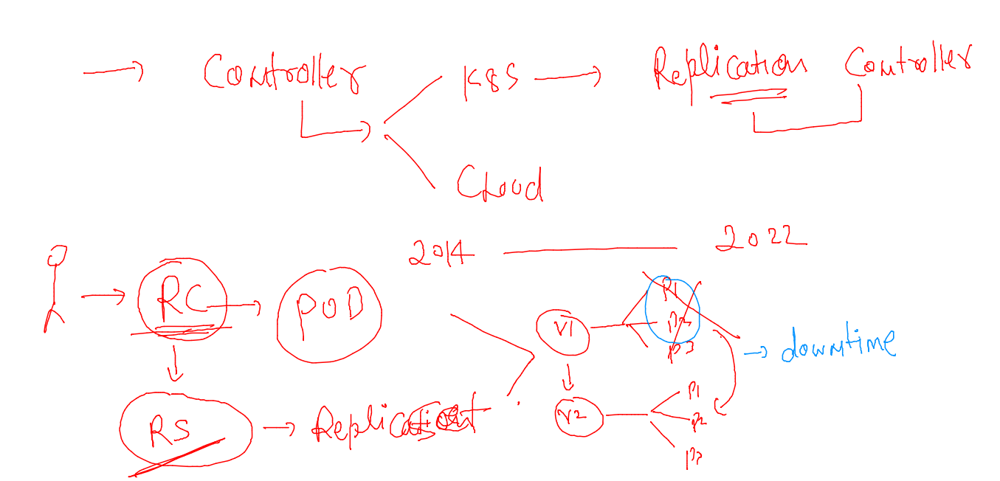
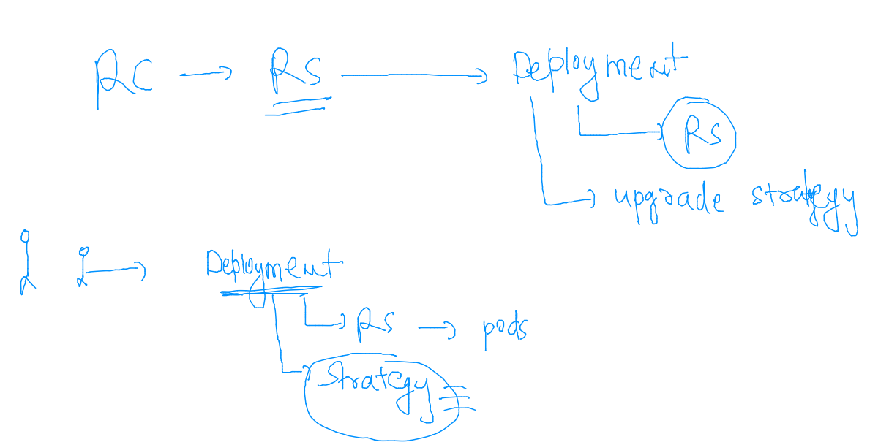

## Docker and kubernetes 

## Revision 

### Understanding using Jenkins -- CI process


### how pod got scheduled 


### pod with labels concept in particular namespaces 


### lets clean up namespace resources 

```
[ashu@ip-172-31-27-51 images]$ kubectl config get-contexts 
CURRENT   NAME                          CLUSTER      AUTHINFO           NAMESPACE
*         kubernetes-admin@kubernetes   kubernetes   kubernetes-admin   ashu-project
[ashu@ip-172-31-27-51 images]$ kubectl get po,svc
NAME             READY   STATUS    RESTARTS      AGE
pod/ashuwebpod   1/1     Running   2 (56m ago)   16h

NAME              TYPE       CLUSTER-IP      EXTERNAL-IP   PORT(S)          AGE
service/ashulb1   NodePort   10.102.22.126   <none>        1234:30868/TCP   16h
[ashu@ip-172-31-27-51 images]$ kubectl delete pod,svc --all
pod "ashuwebpod" deleted
service "ashulb1" deleted
[ashu@ip-172-31-27-51 images]$ 

```

### creating pod 

```
 kubectl run ashuwebapp --image=dockerashu/ashuapp:mobiv1 --port 80    --dry-run=client -o yaml  >newwebpod.yaml
```
### lets run it 

```
[ashu@ip-172-31-27-51 k8syamls]$ kubectl create -f newwebpod.yaml 
pod/ashuwebapp created
[ashu@ip-172-31-27-51 k8syamls]$ kubectl  get  po
NAME         READY   STATUS    RESTARTS   AGE
ashuwebapp   1/1     Running   0          5s
[ashu@ip-172-31-27-51 k8syamls]$ kubectl  get  po -o wide
NAME         READY   STATUS    RESTARTS   AGE   IP              NODE    NOMINATED NODE   READINESS GATES
ashuwebapp   1/1     Running   0          10s   192.168.135.3   node3   <none>           <none>
[ashu@ip-172-31-27-51 k8syamls]$ 


```

### describe pod 

```
[ashu@ip-172-31-27-51 ~]$ kubectl describe pod  ashuwebapp 
Name:         ashuwebapp
Namespace:    ashu-project
Priority:     0
Node:         node3/172.31.26.16
Start Time:   Wed, 17 Aug 2022 05:12:27 +0000
Labels:       run=ashuwebapp
Annotations:  cni.projectcalico.org/containerID: 486337804d40067451777b12e2f773a4b4c8ed41319f28da9ecee97c3b561731
              cni.projectcalico.org/podIP: 192.168.135.3/32
              cni.projectcalico.org/podIPs: 192.168.135.3/32
Status:       Running
IP:           192.168.135.3
IPs:
  IP:  192.168.135.3
Containers:
  ashuwebapp:
    Container ID:   containerd://1e229dfe8d134be79a93c5b547f322d11eeb66db9f5897f60552a42d4cb38a4d
    Image:          dockerashu/ashuapp:mobiv1
    Image ID:       docker.io/dockerashu/ashuapp@sha256:7e053cf4679bf4027c48e93108474daa9ef31a3f48758f0efe27ada00289a1fb
    Port:           80/TCP

```

### checking label of pod 

```
[ashu@ip-172-31-27-51 ~]$ kubectl get po --show-labels 
NAME         READY   STATUS    RESTARTS   AGE   LABELS
ashuwebapp   1/1     Running   0          13m   run=ashuwebapp
[ashu@ip-172-31-27-51 ~]$ 

```

### creating nodeport service in k8s 

```
[ashu@ip-172-31-27-51 k8syamls]$ kubectl  create  service  
Create a service using a specified subcommand.

Aliases:
service, svc

Available Commands:
  clusterip      Create a ClusterIP service
  externalname   Create an ExternalName service
  loadbalancer   Create a LoadBalancer service
  nodeport       Create a NodePort service

```

### creating service 

```
kubectl  create  service   nodeport  ashulb1  --tcp  1234:80  --dry-run=client -o yaml >newnodeport.yaml 
```
### service need label of pod to find 


### pod label to service selector 


### checking 

```
[ashu@ip-172-31-27-51 k8syamls]$ kubectl  create  -f newnodeport.yaml 
service/ashulb1 created
[ashu@ip-172-31-27-51 k8syamls]$ kubectl get  svc 
NAME      TYPE       CLUSTER-IP     EXTERNAL-IP   PORT(S)          AGE
ashulb1   NodePort   10.98.74.143   <none>        1234:30621/TCP   9s
[ashu@ip-172-31-27-51 k8syamls]$ kubectl get  svc -o wide
NAME      TYPE       CLUSTER-IP     EXTERNAL-IP   PORT(S)          AGE   SELECTOR
ashulb1   NodePort   10.98.74.143   <none>        1234:30621/TCP   13s   run=ashuwebapp
[ashu@ip-172-31-27-51 k8syamls]$ 

```

### service delete 

```
[ashu@ip-172-31-27-51 ~]$ kubectl get  svc
NAME      TYPE       CLUSTER-IP     EXTERNAL-IP   PORT(S)          AGE
ashulb1   NodePort   10.98.74.143   <none>        1234:30621/TCP   14m
[ashu@ip-172-31-27-51 ~]$ kubectl delete svc  ashulb1 
service "ashulb1" deleted
[ashu@ip-172-31-27-51 ~]$ 


```

### creating service to automatically match pod label 

```
[ashu@ip-172-31-27-51 ~]$ kubectl  get  po 
NAME         READY   STATUS    RESTARTS   AGE
ashuwebapp   1/1     Running   0          38m
[ashu@ip-172-31-27-51 ~]$ 
[ashu@ip-172-31-27-51 ~]$ kubectl expose  pod  ashuwebapp  --type NodePort --port  1234 --target-port 80 --name ashulb2 
service/ashulb2 exposed
[ashu@ip-172-31-27-51 ~]$ kubectl get svc -owide
NAME      TYPE       CLUSTER-IP      EXTERNAL-IP   PORT(S)          AGE   SELECTOR
ashulb2   NodePort   10.100.54.141   <none>        1234:31586/TCP   20s   run=ashuwebapp
[ashu@ip-172-31-27-51 ~]$ 


```

### combine yAML 

```
apiVersion: v1
kind: Pod
metadata:
  creationTimestamp: null
  labels: # label of my pod 
    run: ashuwebapp # label of pod 
  name: ashuwebapp # name of pod 
spec:
  containers:
  - image: dockerashu/ashuapp:mobiv1
    name: ashuwebapp
    ports:
    - containerPort: 80
    resources: {}
  dnsPolicy: ClusterFirst
  restartPolicy: Always
status: {}
# lets write service yaml here 
---
apiVersion: v1
kind: Service
metadata:
  creationTimestamp: null
  labels:
    app: ashulb1
  name: ashulb1
spec:
  ports:
  - name: 1234-80
    port: 1234
    protocol: TCP
    targetPort: 80
  selector: # pod finder 
    run: ashuwebapp
  type: NodePort
status:
  loadBalancer: {}

```

### lets deploy it 

```
[ashu@ip-172-31-27-51 k8syamls]$ kubectl create -f  combine.yaml  
pod/ashuwebapp created
service/ashulb1 created
[ashu@ip-172-31-27-51 k8syamls]$ kubectl get po
NAME         READY   STATUS    RESTARTS   AGE
ashuwebapp   1/1     Running   0          12s
[ashu@ip-172-31-27-51 k8syamls]$ kubectl get svc
NAME      TYPE       CLUSTER-IP     EXTERNAL-IP   PORT(S)          AGE
ashulb1   NodePort   10.110.44.30   <none>        1234:30646/TCP   17s
[ashu@ip-172-31-27-51 k8syamls]$ 
```

### COntroller in k8s 



### Deployment 



### creating deployment 

```
kubectl create  deployment  ashudeploy1  --image=dockerashu/ashuapp:mobiv1  --port 80 --dry-run=client  -o yaml  >deployment.yaml 
```

### YAML 

```
apiVersion: apps/v1
kind: Deployment
metadata:
  creationTimestamp: null
  labels:
    app: ashudeploy1
  name: ashudeploy1 # name of deployment  
spec:
  replicas: 1 # number of pods we want 
  selector:
    matchLabels:
      app: ashudeploy1
  strategy: {} # upgrade / deployment strategy 
  template: # to create pods 
    metadata:
      creationTimestamp: null
      labels:
        app: ashudeploy1
    spec:
      containers:
      - image: dockerashu/ashuapp:mobiv1
        name: ashuapp
        ports:
        - containerPort: 80
        resources: {}
status: {}

```

### deploy yaml 

```
[ashu@ip-172-31-27-51 k8syamls]$ kubectl  create -f deployment.yaml 
deployment.apps/ashudeploy1 created
[ashu@ip-172-31-27-51 k8syamls]$ kubectl  get  deployment 
NAME          READY   UP-TO-DATE   AVAILABLE   AGE
ashudeploy1   1/1     1            1           7s
[ashu@ip-172-31-27-51 k8syamls]$ kubectl  get  rs
NAME                     DESIRED   CURRENT   READY   AGE
ashudeploy1-7fd896568d   1         1         1       18s
[ashu@ip-172-31-27-51 k8syamls]$ kubectl  get  po
NAME                           READY   STATUS    RESTARTS   AGE
ashudeploy1-7fd896568d-gmnxc   1/1     Running   0          27s
[ashu@ip-172-31-27-51 k8syamls]$ 

```

### checking self healing 

```
[ashu@ip-172-31-27-51 ~]$ kubectl  get  po  -o wide 
NAME                           READY   STATUS    RESTARTS   AGE    IP               NODE    NOMINATED NODE   READINESS GATES
ashudeploy1-7fd896568d-gmnxc   1/1     Running   0          105s   192.168.135.31   node3   <none>           <none>
[ashu@ip-172-31-27-51 ~]$ kubectl  delete pod  ashudeploy1-7fd896568d-gmnxc
pod "ashudeploy1-7fd896568d-gmnxc" deleted
[ashu@ip-172-31-27-51 ~]$ kubectl  get  po  -o wide 
NAME                           READY   STATUS    RESTARTS   AGE   IP                NODE    NOMINATED NODE   READINESS GATES
ashudeploy1-7fd896568d-tq28h   1/1     Running   0          4s    192.168.166.166   node1   <none>           <none>
[ashu@ip-172-31-27-51 ~]$ 

```

### scaling 

```
[ashu@ip-172-31-27-51 ~]$ kubectl  get  po  -o wide 
NAME                           READY   STATUS    RESTARTS   AGE   IP                NODE    NOMINATED NODE   READINESS GATES
ashudeploy1-7fd896568d-tq28h   1/1     Running   0          68s   192.168.166.166   node1   <none>           <none>
[ashu@ip-172-31-27-51 ~]$ kubectl  get  deploy 
NAME          READY   UP-TO-DATE   AVAILABLE   AGE
ashudeploy1   1/1     1            1           4m43s
[ashu@ip-172-31-27-51 ~]$ 
[ashu@ip-172-31-27-51 ~]$ kubectl scale  deployment   ashudeploy1  --replicas 3
deployment.apps/ashudeploy1 scaled
[ashu@ip-172-31-27-51 ~]$ kubectl  get  deploy 
NAME          READY   UP-TO-DATE   AVAILABLE   AGE
ashudeploy1   3/3     3            3           5m59s
[ashu@ip-172-31-27-51 ~]$ kubectl  get po -o wide 
NAME                           READY   STATUS    RESTARTS   AGE     IP                NODE    NOMINATED NODE   READINESS GATES
ashudeploy1-7fd896568d-l64bg   1/1     Running   0          24s     192.168.135.52    node3   <none>           <none>
ashudeploy1-7fd896568d-tq28h   1/1     Running   0          3m26s   192.168.166.166   node1   <none>           <none>
ashudeploy1-7fd896568d-v4smp   1/1     Running   0          24s     192.168.104.60    node2   <none>           <none>
[ashu@ip-172-31-27-51 ~]$ 

```

### creating service of nodeport type 

```
[ashu@ip-172-31-27-51 ~]$ kubectl  get po --show-labels 
NAME                           READY   STATUS    RESTARTS   AGE     LABELS
ashudeploy1-7fd896568d-l64bg   1/1     Running   0          2m28s   app=ashudeploy1,pod-template-hash=7fd896568d
ashudeploy1-7fd896568d-tq28h   1/1     Running   0          5m30s   app=ashudeploy1,pod-template-hash=7fd896568d
ashudeploy1-7fd896568d-v4smp   1/1     Running   0          2m28s   app=ashudeploy1,pod-template-hash=7fd896568d
[ashu@ip-172-31-27-51 ~]$ 
[ashu@ip-172-31-27-51 ~]$ 
[ashu@ip-172-31-27-51 ~]$ kubectl  get  deploy 
NAME          READY   UP-TO-DATE   AVAILABLE   AGE
ashudeploy1   3/3     3            3           8m59s
[ashu@ip-172-31-27-51 ~]$ kubectl expose  deployment  ashudeploy1  --type NodePort  --port 1234 --target-port 80 --name ashulb3 
service/ashulb3 exposed
[ashu@ip-172-31-27-51 ~]$ kubectl  get  svc
NAME      TYPE       CLUSTER-IP      EXTERNAL-IP   PORT(S)          AGE
ashulb3   NodePort   10.97.164.167   <none>        1234:31548/TCP   8s
[ashu@ip-172-31-27-51 ~]$ 


```

### Delete all resources 

```
[ashu@ip-172-31-27-51 ~]$ kubectl  get  deploy 
NAME          READY   UP-TO-DATE   AVAILABLE   AGE
ashudeploy1   3/3     3            3           8m59s
[ashu@ip-172-31-27-51 ~]$ kubectl expose  deployment  ashudeploy1  --type NodePort  --port 1234 --target-port 80 --name ashulb3 
service/ashulb3 exposed
[ashu@ip-172-31-27-51 ~]$ kubectl  get  svc
NAME      TYPE       CLUSTER-IP      EXTERNAL-IP   PORT(S)          AGE
ashulb3   NodePort   10.97.164.167   <none>        1234:31548/TCP   8s
[ashu@ip-172-31-27-51 ~]$ kubectl delete deploy,svc  --all
deployment.apps "ashudeploy1" deleted
service "ashulb3" deleted
[ashu@ip-172-31-27-51 ~]$ 


```


