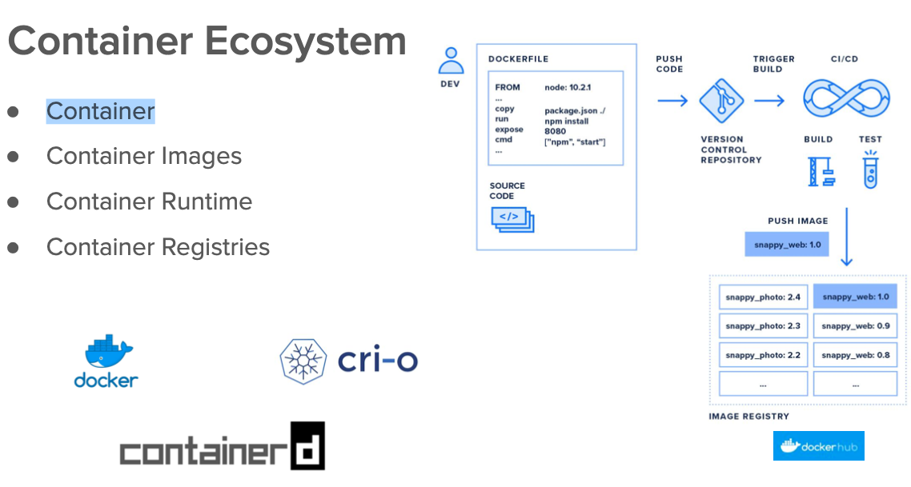

## Docker and kubernetes 

## Revision 

### Understanding using Jenkins -- CI process



### how pod got scheduled 


### pod with labels concept in particular namespaces 


### lets clean up namespace resources 

```
[ashu@ip-172-31-27-51 images]$ kubectl config get-contexts 
CURRENT   NAME                          CLUSTER      AUTHINFO           NAMESPACE
*         kubernetes-admin@kubernetes   kubernetes   kubernetes-admin   ashu-project
[ashu@ip-172-31-27-51 images]$ kubectl get po,svc
NAME             READY   STATUS    RESTARTS      AGE
pod/ashuwebpod   1/1     Running   2 (56m ago)   16h

NAME              TYPE       CLUSTER-IP      EXTERNAL-IP   PORT(S)          AGE
service/ashulb1   NodePort   10.102.22.126   <none>        1234:30868/TCP   16h
[ashu@ip-172-31-27-51 images]$ kubectl delete pod,svc --all
pod "ashuwebpod" deleted
service "ashulb1" deleted
[ashu@ip-172-31-27-51 images]$ 

```

