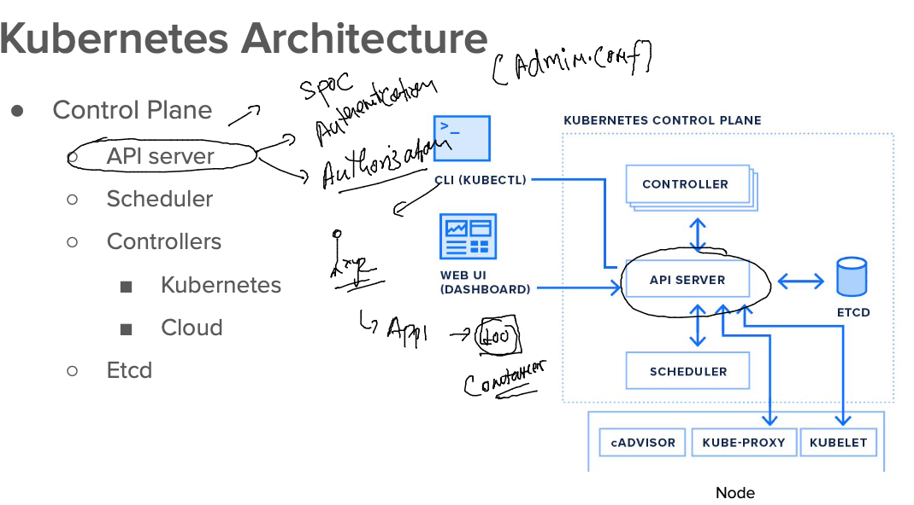
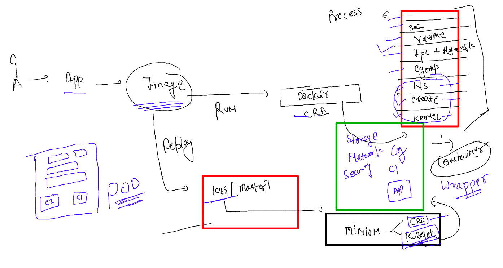

## Docker and kubernetes 

### lets check kubectl to apiserver connection 

```
[ashu@ip-172-31-27-51 images]$ kubectl  get  nodes
NAME     STATUS   ROLES           AGE   VERSION
master   Ready    control-plane   8d    v1.24.3
node1    Ready    <none>          8d    v1.24.3
node2    Ready    <none>          8d    v1.24.3
```

### OCI format for container images 


### k8s master and minion communication 


### apiserver 



### schedular 


### etcd 


## Deploy app in k8s 

###  containerize app  ---->> test-push -registry -- Deploy in k8s 

### lets take Nodejs based application 

### bUild and test 

```
[ashu@ip-172-31-27-51 images]$ git clone https://github.com/redashu/nodeapp.git
Cloning into 'nodeapp'...
remote: Enumerating objects: 18, done.
remote: Counting objects: 100% (18/18), done.
remote: Compressing objects: 100% (13/13), done.
remote: Total 18 (delta 1), reused 0 (delta 0), pack-reused 0
Receiving objects: 100% (18/18), 4.20 KiB | 4.20 MiB/s, done.
Resolving deltas: 100% (1/1), done.
[ashu@ip-172-31-27-51 images]$ ls
admin.conf  ashu-compose  ashucustomer1  java  node  nodeapp  python  webapps
[ashu@ip-172-31-27-51 images]$ 

```

### Dockerfile inside nodeapp directory 

```
FROM node
# using image from docker hub 
WORKDIR /usr/src/app
# either use this or create new one then use 
# to change directory during image build time 
COPY package*.json .
RUN npm install 
RUN npm ci --only=production 
# if only u r building code for production 
COPY . . 
EXPOSE 8080
CMD ["node","server.js"]


```

### .dockerignore 

```
Dockerfile
.dockerignore
.git
README.md
```

### lets build it 

```
[ashu@ip-172-31-27-51 nodeapp]$ docker build -t docker.io/dockerashu/mobiashunode:v1 .
Sending build context to Docker daemon   5.12kB
Step 1/8 : FROM node
latest: Pulling from library/node
001c52e26ad5: Pull complete 
d9d4b9b6e964: Pull complete 
2068746827ec: Pull complete 
9daef329d350: Pull complete 
8a335986117b: Extracting  48.46MB/197.5MB
80c491fe312f: Download complete 
cb9ad7c100c4: Download complete 
ed0a182e3827: Download compl
```

### creating container for app testing 

```
docker  run -d --name ashutc1 -p 1234:8080 docker.io/dockerashu/mobiashunode:v1
64d18244c15d2d68e76cef146f8d411d36430920a2ce2f7d41f63637e7592aab
[ashu@ip-172-31-27-51 nodeapp]$ docker  ps
CONTAINER ID   IMAGE                        COMMAND                  CREATED         STATUS         PORTS                                       NAMES
64d18244c15d   dockerashu/mobiashunode:v1   "docker-entrypoint.s…"   6 seconds ago   Up 5 seconds   0.0.0.0:1234->8080/tcp, :::1234->8080/tcp   ashutc1
```

### Deploy container image in k8s --- 

## k8s usages Pod Concept 




### POd Design 

```
apiVersion: 'v1' # apiserver version 
kind: Pod # resource in k8s to deploy container images 
metadata: # info of pod 
  name: ashupod1 # name of pod 
spec: # about your containerized app
  containers:
  - name: ashuc1
    image: docker.io/dockerashu/mobiashunode:v1
    ports:
    - containerPort: 8080 # container app port 
```

### sending and checking request related to pod 

```
[ashu@ip-172-31-27-51 k8syamls]$ kubectl create -f  ashupod1.yaml 
pod/ashupod1 created
[ashu@ip-172-31-27-51 k8syamls]$ kubectl  get  pods 
NAME          READY   STATUS              RESTARTS   AGE
ashupod1      0/1     ContainerCreating   0          6s
lakshaypod1   0/1     ContainerCreating   0          1s
nehapod1      0/1     ContainerCreating   0          2s
sharathpod1   0/1     ContainerCreating   0          1s
[ashu@ip-172-31-27-51 k8syamls]$ 

```
