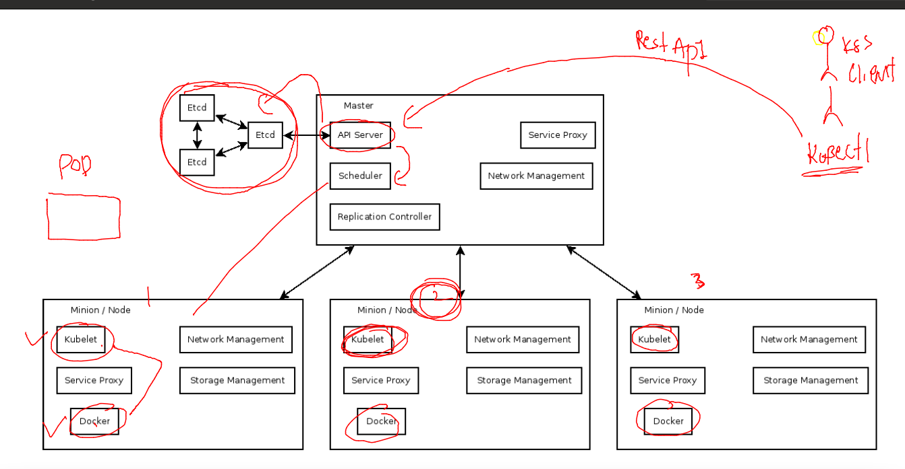

## Docker and kubernetes 

### lets check kubectl to apiserver connection 

```
[ashu@ip-172-31-27-51 images]$ kubectl  get  nodes
NAME     STATUS   ROLES           AGE   VERSION
master   Ready    control-plane   8d    v1.24.3
node1    Ready    <none>          8d    v1.24.3
node2    Ready    <none>          8d    v1.24.3
```

### OCI format for container images 


### k8s master and minion communication 


### apiserver 


### schedular 



### etcd 


